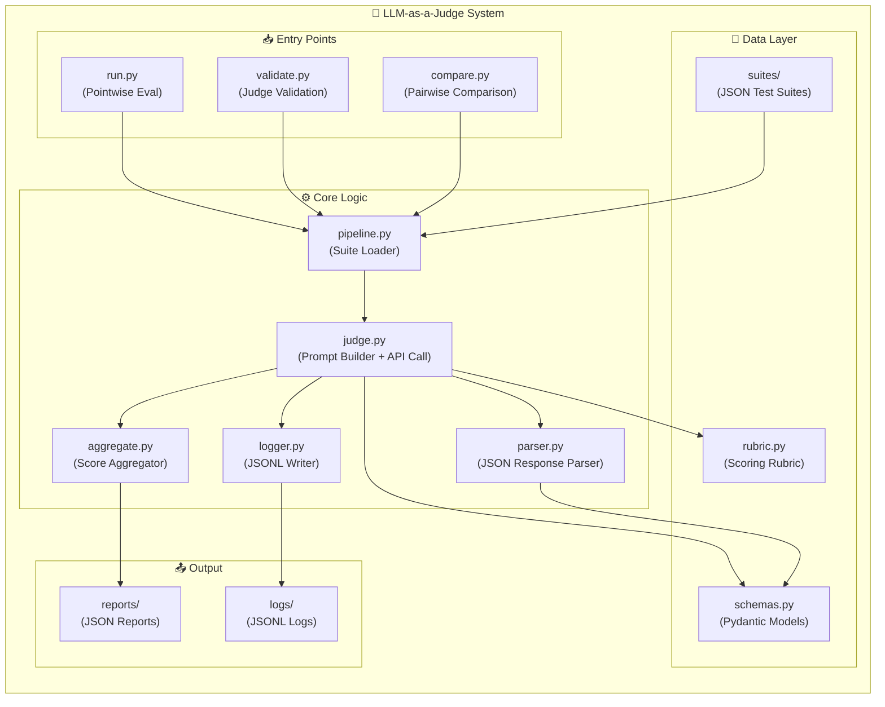
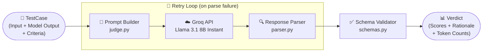
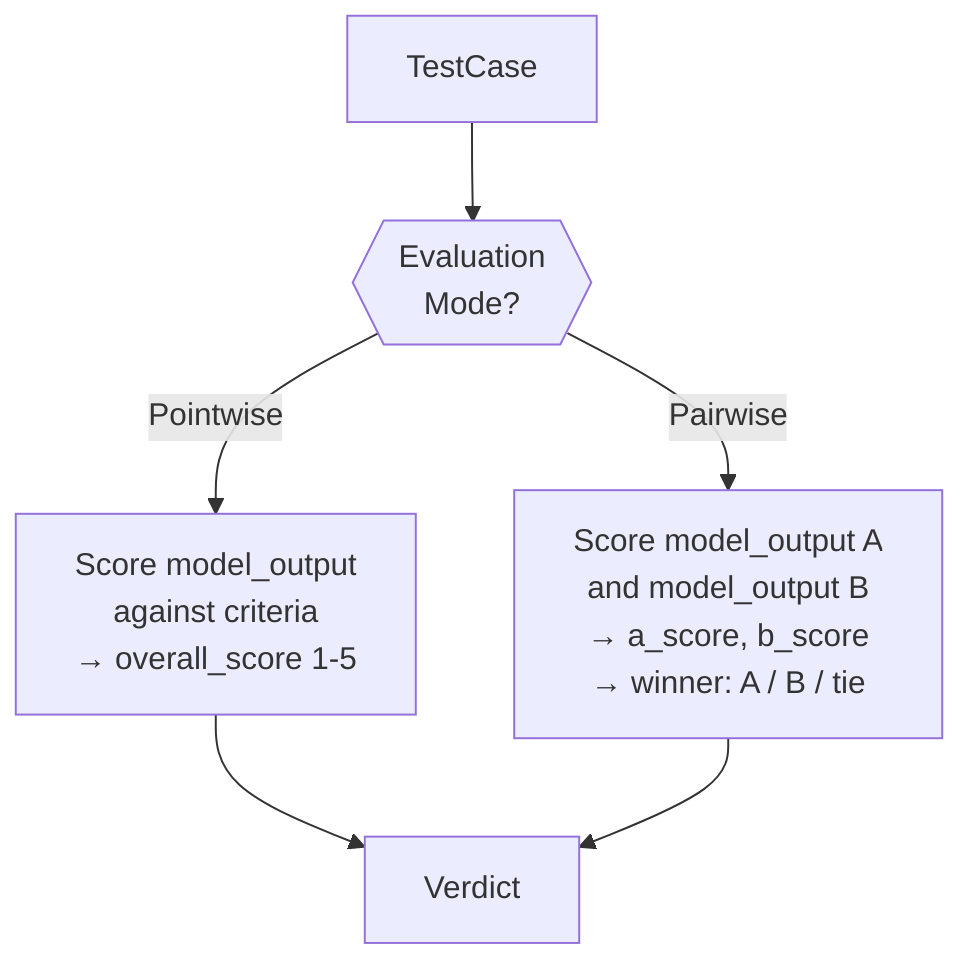
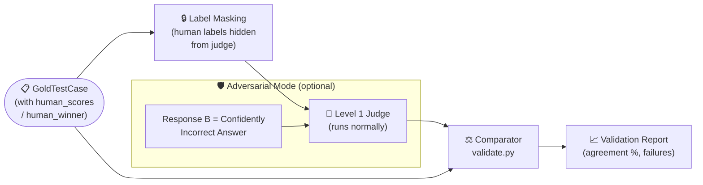
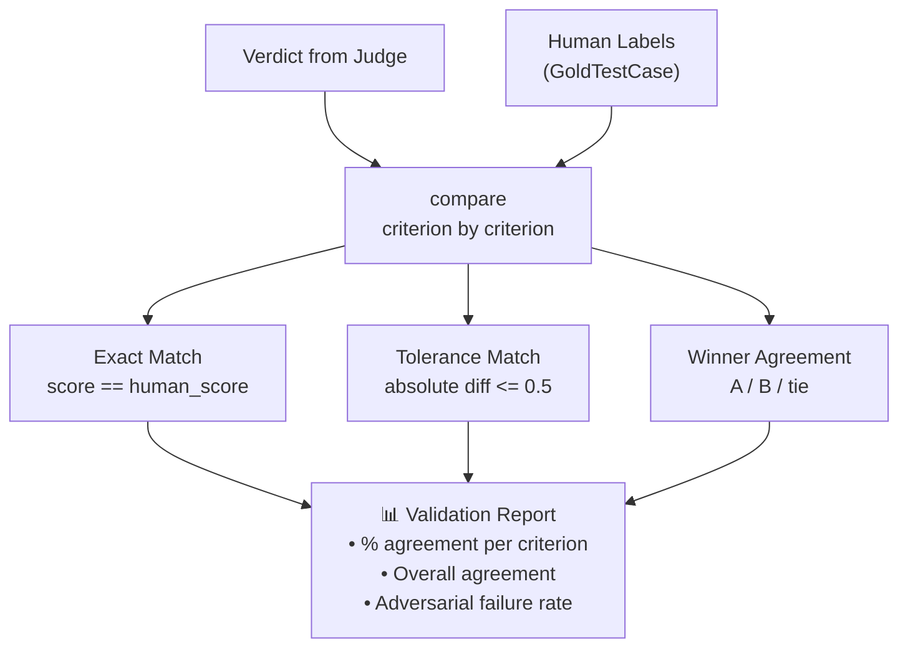
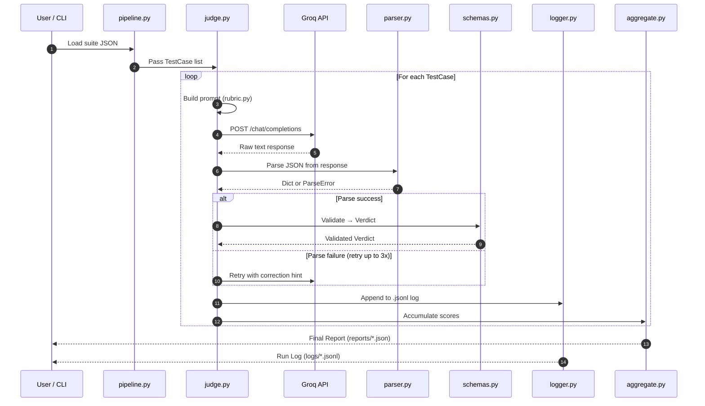
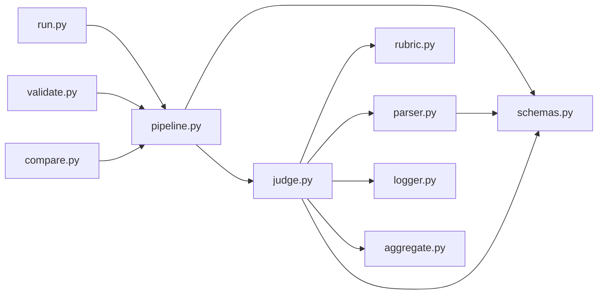
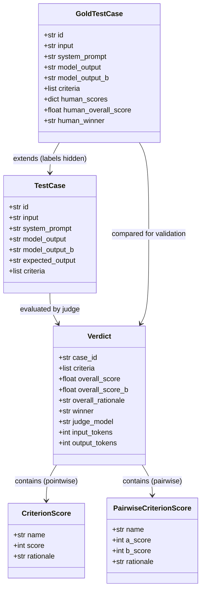

# 🏗️ LLM-as-a-Judge — Architecture Diagram

> Visual reference for the **two-level evaluation system**. Level 1 is the automated LLM Judge; Level 2 is the Judge Validator that audits Level 1 against human-labeled ground truth.

---

## 🗺️ High-Level System Overview



---

## 🔵 Level 1 — The LLM Judge

> **Purpose**: Evaluate a single model output (or two, in pairwise mode) against a rubric and produce a structured `Verdict`.



### Level 1 Key Components

| Module | Role |
|---|---|
| `judge.py` | Builds prompt, calls Groq API, orchestrates retry logic |
| `rubric.py` | Defines the 1–5 scoring rubric per criterion |
| `parser.py` | Extracts structured JSON from raw LLM text response |
| `schemas.py` | Validates parsed output via Pydantic (`Verdict`, `CriterionScore`) |
| `logger.py` | Appends each judge invocation to a `.jsonl` log file |

### Pointwise vs. Pairwise Mode



---

## 🟠 Level 2 — The Judge Validator

> **Purpose**: Audit Level 1's reliability by running it on cases where **human labels are already known**, then measuring agreement.



### Level 2 Key Components

| Module / File | Role |
|---|---|
| `validate.py` | Entry point; loads gold suite, calls judge, computes agreement |
| `schemas.py` | `GoldTestCase` model with `human_scores`, `human_winner` fields |
| `pipeline.py` | Loads and parses `gold_pointwise.json` / `adversarial_suite.json` |
| `aggregate.py` | Accumulates per-criterion agreement statistics |

### Validation Metrics



---

## 🔄 End-to-End Data Flow



---

## 📦 Module Dependency Map



---

## 🗂️ Directory Structure

```
nexpro/
├── run.py              ← Level 1 entry: pointwise evaluation
├── validate.py         ← Level 2 entry: judge validation
├── compare.py          ← Level 1 entry: pairwise comparison
│
├── core/
│   ├── judge.py        ← [L1] Prompt builder + Groq API caller
│   ├── parser.py       ← [L1] LLM response → structured dict
│   ├── pipeline.py     ← [L1/L2] Suite loader
│   ├── rubric.py       ← [L1] Scoring rubric definitions
│   ├── schemas.py      ← [L1/L2] Pydantic models
│   ├── logger.py       ← [L1] JSONL interaction logger
│   ├── aggregate.py    ← [L1/L2] Score aggregation
│   └── replay.py       ← Replay logged runs
│
├── suites/
│   ├── judge_suite.json          ← Standard pointwise test cases
│   ├── gold_pointwise.json       ← Human-labeled pointwise cases
│   ├── gold_pairwise.json        ← Human-labeled pairwise cases
│   └── adversarial_suite.json    ← Adversarial (confidently wrong) cases
│
├── reports/            ← JSON evaluation reports (auto-generated)
├── logs/               ← JSONL judge invocation logs (auto-generated)
└── .env                ← GROQ_API_KEY
```

---

## 🧩 Schema Relationships



---

> **Legend**:
> - 🔵 **Level 1** — Judge: automated LLM scoring of model outputs
> - 🟠 **Level 2** — Validator: human-agreement audit of the judge itself
> - 🛡️ **Adversarial** — Special Level 2 mode testing judge robustness
